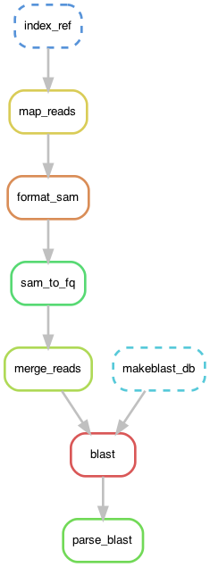

This is an example of a snakemake workflow for the BWA mapping through nucleotide blast parsing steps.



This snakemake workflow doesn't include the spades assembly step as in most cases there were not enough reads to form contig files, so this workflow checks blast match to reads (bbmerged to merge paired reads when possible).

### Software
- Software environment can be installed using conda (i.e., miniconda) and the [`environment.yml`](./environment.yml) file. 
```
conda env create -f environment.yml
conda activate metagen_bwa
```
- BBtools (containing `bbmerge`) has to be installed separately, as conda installation with `agbiome` channel didn't work. I saved the installer in my `Downloads/` directory, so the Snakefile specifies the path as `~/Downloads/bbmap/bbmerge.sh`. [Instructions here](https://jgi.doe.gov/data-and-tools/bbtools/bb-tools-user-guide/installation-guide/).

### Running snakemake

Required inputs: 
   - WGS files (R1 and R2 fastq) in a directory called `input_fqs`
   - mitochondria/chloroplast genome fasta files for BWA mapping in a directory called `mito_refs`
   - reference for blast search (NCBI nt database or other ref set) in a directory called `blast_ref`
   - [`mapblast_parse.py`](./mapblast_parse.py)

Snakefile can be run as:
```
snakemake -p -j 1 all
```

Final parsed blast output files will be in a directory called `parsed_blast_outs`.

#### extras
The diagram was made with `graphviz`:
```
conda install graphviz
snakemake --dag ts32juni_blastout_parsed.txt | dot -Tpng > dag_metagen.png
```
